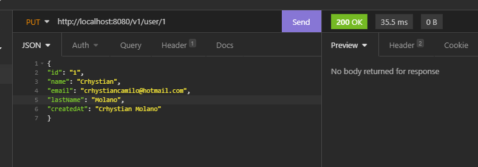
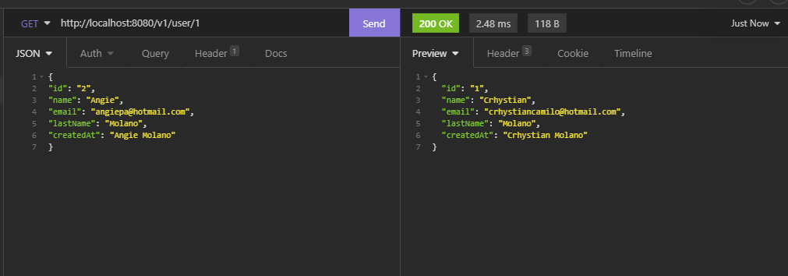
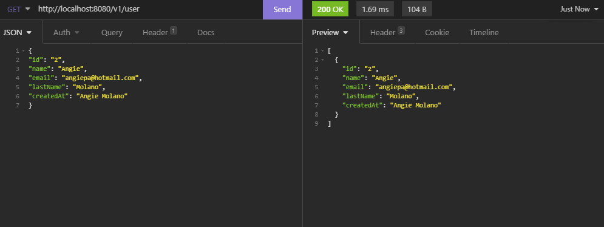
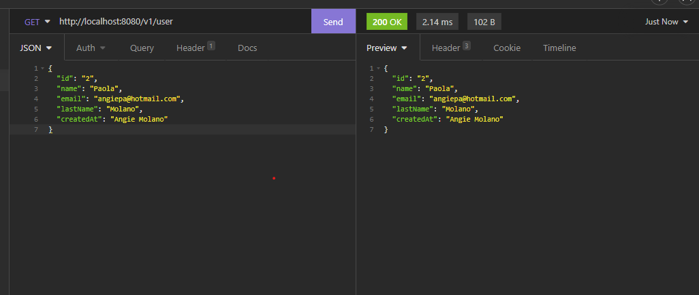

# Goals

 - Explain what needs to be done to achieve the Level 2 on a RESTFUL API
   on the Richardson Maturity Model.
 - Implement a Level 2 Users RESTFUL API Microservice.
 - Implement a Level 2 Tasks RESTFUL API Microservice.
 - User dependencies injections to create a decoupled architecture.

# Growth Mindset
"Individuals who believe their talents can be developed (through hard work, good strategies, and input from others) have a growth mindset. They tend to achieve more than those with a more fixed mindset (those who believe their talents are innate gifts)" What Having a "Growth Mindset" Actually means - Harvard Business Review
# MaIn Topics

 - Microservices.
 - RESTFUL API.
 - Richardson Maturity Model.
 - Dependencies Injection.

# Codelab 🤹🏽
🗣️ "I hear and I forget I see and I remember I do and I understand." Confucius
## Part 1: Implementing the Users Microservice RESTFUL API

 1. Create a new project using the Spring Initializr .
 2. Use either **Java** or **Kotlin** as programming language.
 3. Use **Gradle** as project option (if your computer is slow then use
    Maven).
 4. Add Spring Web dependency before generating the project.
 5. Use latest Spring Boot version (make sure your selection doesn't
    contain SNAPSHOT or M1 (those are probably not as stable as the rest).
 6. Click on generate.
 7. Go to your Github  account.
 8. Create a new public repo, name it as you like.
 9. Commit/push the files generated in 7.
 10. Open the project on favorite editor (IntelliJ IDEA is highly
     recommended throughout this course).
 11. Create a new package called ***dto*** and inside define your ***UserDto***
     object with at least the following fields:

       - name
       - email
       - lastName

12. Create a new package called ***data*** and inside define your ***User*** data object with at least the following fields (Types don't matter yet, just be sure both DTO classes and Data classes types are consistent enough): 
	- id
	- name
	- email
	- lastName
	- createdAt
	
13. Create a new package called ***service*** and inside create the following interface:

    ```java
     public interface UserService
     {
         User create( User user );

         User findById( String id );
         
         List<User> getAll();

         void deleteById( String id );

         User update( UserDto userDto, String userId );
     }  
14. Create an implementation of the ***UserService*** using a HashMap data structure inside.
15. Make your service implementation ***UserServiceHashMap*** injectable using the ***@Service*** annotation.
16. Create a new package called ***controller*** and create a new class ***UserController*** inside.
17. Annotate your ***UserController*** so it becomes a ***REST*** Controller:

    ```java
     @RestController
     @RequestMapping( "/v1/user" )
     public class UserController
     {
     }  
18. Inject your ***UserService*** implementation inside the ***UserController*** via the constructor:
    ```java
     @RestController
     @RequestMapping( "/v1/user" )
     public class UserController {
	     private final UserService userService;

		 public UserController(@Autowired UserService userService) {
			 this.userService = userService;
		 }
     }  
19.  Implement all the endpoints needed to interact with you  _UserService_. Use the following method signatures to help you achieve the Level 2 RESTFUL Maturity:
   ```java
@RestController
@RequestMapping( "/v1/user" )
public class UserController {
  
	    private final UserService userService;

	    public UserController(@Autowired UserService userService ) {
	        this.userService = userService;
	    }


	    @GetMapping
	    public ResponseEntity<List<User>> getAll() {
	        //TODO implement this method using UserService
	        return null;
	    }
	   
	    @GetMapping( "/{id}" )
	    public ResponseEntity<User> findById( @PathVariable String id ) {
	       //TODO implement this method using UserService
	       return null;
	    }
	   
	   
	    @PostMapping
	    public ResponseEntity<User> create( @RequestBody UserDto userDto ) {
	         //TODO implement this method using UserService
	         return null;
	    }
	   
	    @PutMapping( "/{id}" )
	    public ResponseEntity<User> update( @RequestBody UserDto userDto, @PathVariable String id ) {
	         //TODO implement this method using UserService
	         return null;
	    }

	    @DeleteMapping( "/{id}" )
	    public ResponseEntity<Boolean> delete( @PathVariable String id ) {
	         //TODO implement this method using UserService
	        return null;      
	    }
  }
 ```

20. Build / Run your project.
21. Download and install [Insomnia](https://insomnia.rest/download) and test ALL the endpoints of your API.

## Part 2: Implementing the Tasks Microservice RESTFUL API
1. Follow the previous part 10 first steps
2. Create a new package called ***dto*** and inside define your ***TaskDto*** object with at least the following fields:
	- name
	- description
	- status ( TODO, DOING, REVIEW and DONE )
	- assignedTo
	- dueDate
3. Create a new package called ***data*** and inside define your ***Task*** data object with at least the following fields:
	- id
	- name
	- description
	- status ( TODO, DOING, REVIEW and DONE )
	- assignedTo
	- dueDate
	- created
4. Create a new package called ***service*** and inside create the following interface:
	```java
	public interface TaskService
    {
        Task create( Task task );

        Task findById( String id );
        
        List<Task> getAll();

        boolean deleteById( String id );

        Task update( TaskDto taskDto, String id );
    }
    ```
5. Create an implementation of the ***TaskService*** using a ***HashMap*** data structure inside.
6. Make sure your service implementation ***TaskServiceHashMap*** is injectable using the ***@Service*** annotation.
7. Implement your ***TaskController*** (Try to avoid copy paste, use the **User Microservice** as a reference but try doing it conciously).
8. Test ALL the endpoints of your API using **Insomnia**.

### Crear Usuario



verificación


### Ver los usuarios


### ver usuario



### eliminar usuario


verificación


## 

### editar usuario


verificación




Remember to add your both **Github** repos url into the **Ada** input box to deliver correctly your codelab.
